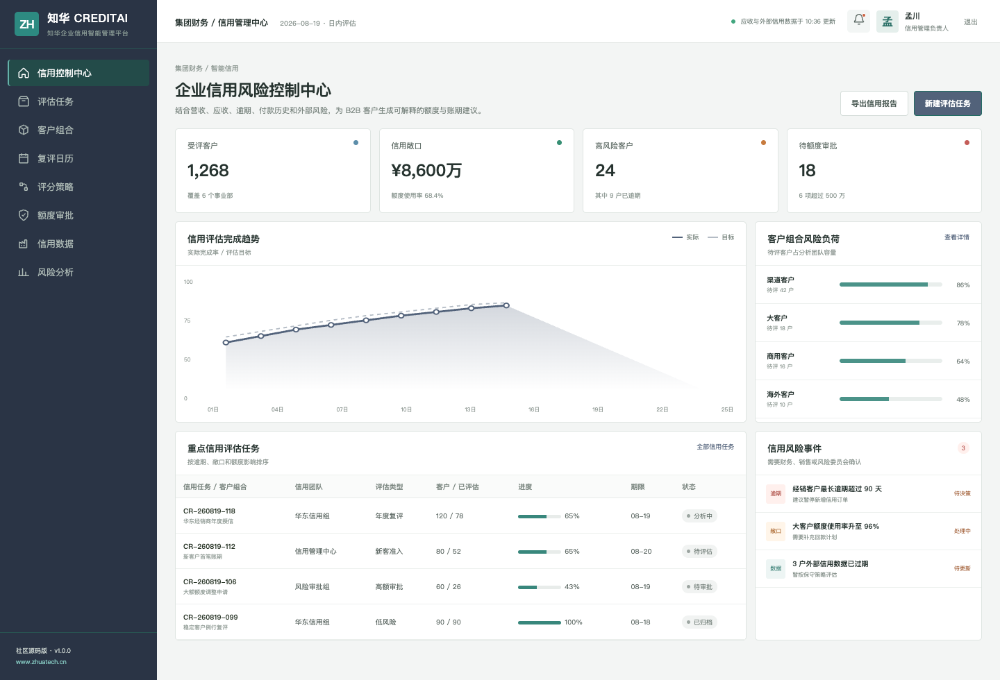
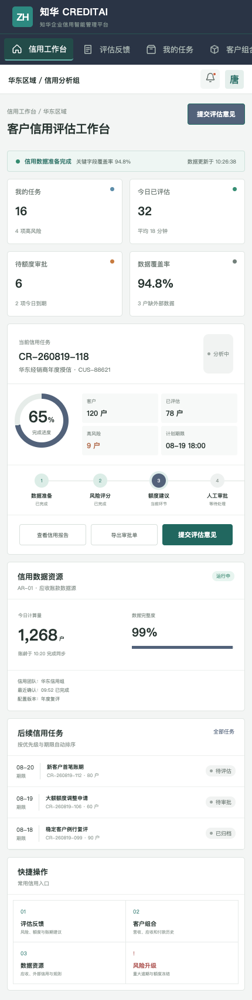

# CreditAI：企业信用风险与额度决策社区版

> 出品方：[知华科技（上海如静知华信息科技有限公司）](https://www.zhuatech.cn/)　Java 包名：`cn.zhuatech.creditai`

CreditAI 为财务、销售运营和信用管理团队提供 B2B 客户信用评估工作台。系统综合年度营收、当前应收、最长逾期、延迟付款次数、经营年限与外部风险，输出风险等级、建议可用额度、账期策略和完整原因。



## 决策原则

CreditAI 不直接批准授信。高风险客户、大额额度和异常账期始终进入授权人员审批；社区版规则完全本地运行，不依赖外部 API Key，也不包含任何真实征信数据。

```text
营收 / 应收 / 逾期 / 付款历史 / 外部风险
                    ↓
              可解释风险评分
                    ↓
        建议额度 + 账期策略 + 人工审批
```

核心接口：`POST /api/ai/credit/assess`。



## 工程能力

- 客户准入、年度复评、额度调整和风险冻结工作流
- `LOW / MEDIUM / HIGH` 风险分层
- 标准账期、人工复核、现金预付三类建议
- 客户组合、应收账龄、复评日历、额度审批与风险分析
- Java 21、Spring Boot 4、MySQL 8、Vue 3、Docker Compose
- JUnit、MockMvc、H2、JWT、Flyway 和接口文档

## 启动前端演示

```bash
cd frontend
npm install
npm run dev:demo
```

访问 `http://localhost:5173`；管理端 `planner / Demo@2026`，分析师端 `operator / Demo@2026`。演示企业、营收、应收和额度均为虚构信息。

文档入口：[API](docs/api.md) · [系统架构](docs/architecture.md) · [数据设计](docs/database.md) · [部署](deploy/README.md)

## 许可与联系

本工程仅能用于个人、非商业学习交流，**不得商用**。企业内部使用、生产部署、SaaS、交付、收费服务、品牌替换和商业发行，须取得上海如静知华信息科技有限公司书面授权，以 [LICENSE](LICENSE) 为准。

信用管理、应收风控、ERP/CRM 集成、AI 私有化与软件项目外包，请访问[知华科技官网](https://www.zhuatech.cn/)或扫码咨询：

| 技术与方案 | 授权与定制 |
| --- | --- |
|  |  |

搜索关键词：企业信用管理、客户信用评分、授信额度、应收账款风控、Java AI 源码、知华科技。
